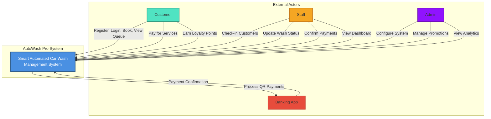

# Context Diagram - AutoWash Pro System

## System Context Overview

---

## Key Actors and Their Responsibilities

### 1. **Customer**
- Registers and logs in
- Manages vehicle information
- Books car wash services
- Selects service packages and time slots
- Makes payments via QR Banking or internal wallet
- Tracks queue status in real-time
- Views booking history and invoices
- Accumulates and redeems loyalty points
- Rates services and provides feedback

### 2. **Staff**
- Checks in walk-in customers
- Manages the real-time queue
- Updates car wash status
- Confirms QR Banking payments
- Manages service changes on-site
- Accesses operations dashboard
- Tracks vehicle progress

### 3. **Admin**
- Configures system parameters (peak hours, slots, pricing)
- Manages loyalty program settings
- Creates and manages promotional campaigns
- Views and analyzes business metrics
- Tracks refunds and payment issues
- Manages customer tier system

### 4. **Banking App**
- Processes QR Banking payments
- Sends payment confirmation/failure status
- Handles refunds and chargebacks

---

## System Boundaries

### **In Scope:**
 Customer registration and authentication  
 Vehicle management  
 Advance booking with slot management  
 Real-time queue management  
 Payment processing (QR Banking & Internal Wallet)  
 Loyalty program and membership tiers  
 Promotion management  
 Operations dashboard for staff  
 Business analytics and reporting  
 Service quality rating system  

### **Out of Scope:**
 Physical car wash equipment control  
 Multi-location support (single location only)  
 Direct banking integration (only QR code)  
 Inventory management for supplies  
 Employee payroll or HR management  

---

## Data Flow Summary

### Information Flows:
1. **Booking Flow** -> Customer -> System -> Staff -> Notification Service
2. **Payment Flow** -> Customer -> System -> Banking App -> System -> Confirmation
3. **Loyalty Flow** -> System -> Customer (Points) + Admin (Tier Management)
4. **Analytics Flow** -> System -> Admin (Reports & Dashboard)
5. **Queue Flow** -> Staff -> System -> Customer (Real-time Updates)

