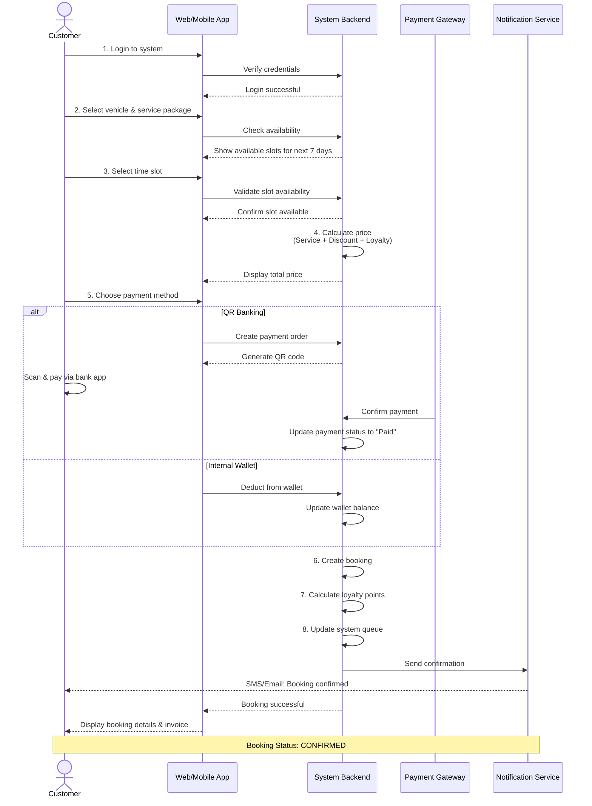
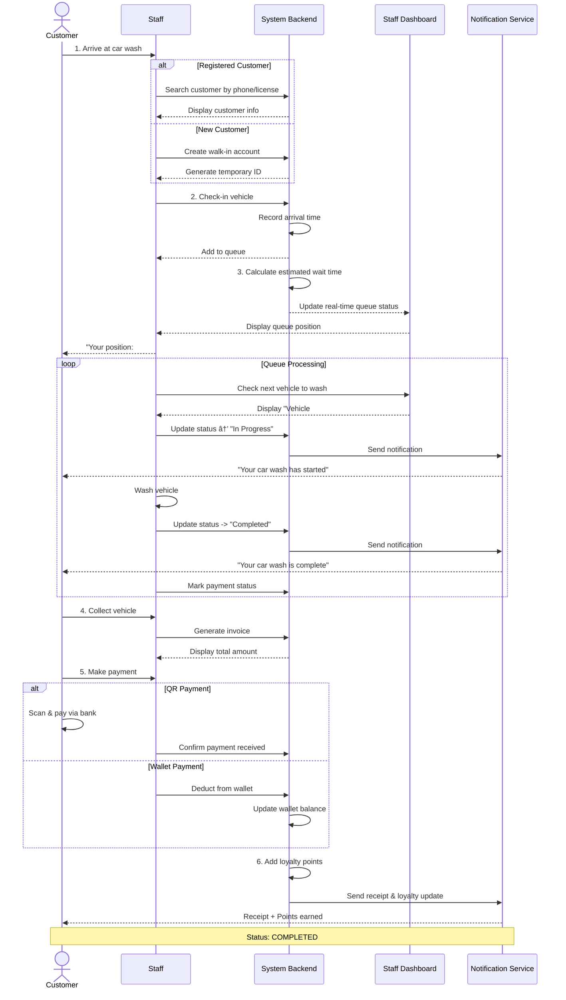
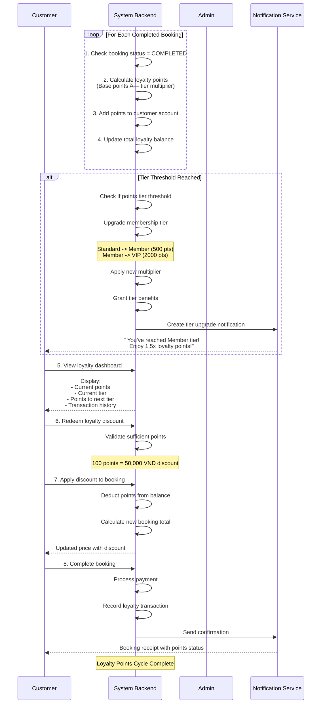
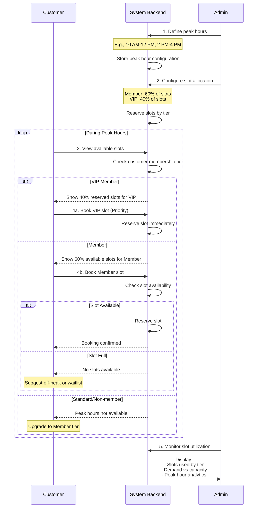
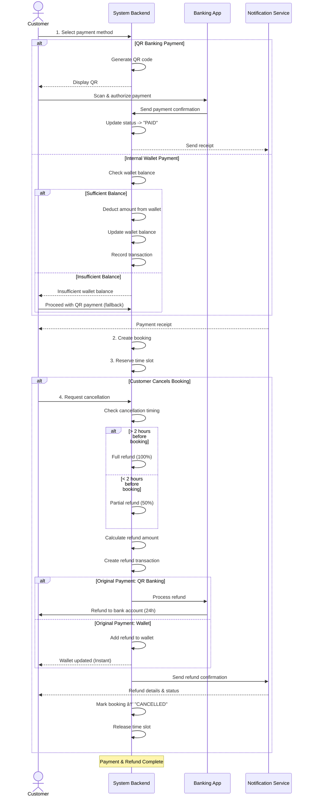
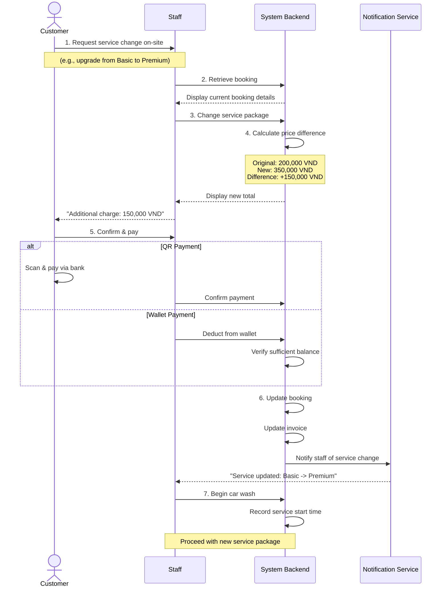

# Main Flows - AutoWash Pro System

## 1. Booking Flow

---

## 2. Walk-in Queue Flow

---

## 3. Loyalty Program Flow

---

## 4. Peak Hour Slot Allocation Flow

---

## 5. Payment & Refund Flow

---

## 6. Service Change Flow (On-Site)

---

## Flow Statistics Summary

| Flow | Participants | Key Decision Points | Average Duration |
|------|--------------|-------------------|------------------|
| **Booking** | Customer -> System -> Payment | Slot availability, Payment method | 5-10 minutes |
| **Walk-in** | Staff -> System -> Customer | Customer status, Payment method | 15-60 minutes |
| **Loyalty** | System -> Customer | Tier threshold, Redemption | Ongoing |
| **Peak Hour Allocation** | Admin -> System -> Customer | Membership tier, Time | Real-time |
| **Payment & Refund** | System -> Bank/Wallet | Payment method, Refund policy | 24 hours max |
| **Service Change** | Staff -> System -> Customer | New package, Price difference | 2-5 minutes |

