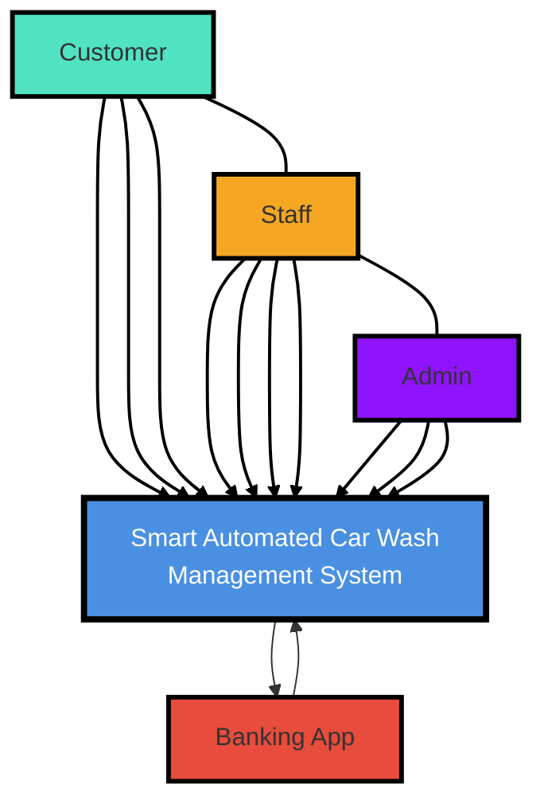

```mermaid
graph TB

    %% =========================
    %% TOP ACTORS
    %% =========================

    Customer["Customer"]
    Staff["Staff"]
    Admin["Admin"]

    %% =========================
    %% CENTER SYSTEM
    %% =========================

    System["Smart Automated Car Wash<br/>Management System"]

    %% =========================
    %% BOTTOM SERVICE
    %% =========================

    Bank["Banking App"]

    %% =========================
    %% FORCE POSITION
    %% =========================

    Customer --- Staff
    Staff --- Admin

    %% =========================
    %% CUSTOMER INTERACTIONS
    %% =========================

    Customer --> System
    Customer --> System
    Customer --> System

    %% =========================
    %% STAFF INTERACTIONS
    %% =========================

    Staff --> System
    Staff --> System
    Staff --> System
    Staff --> System

    %% =========================
    %% ADMIN INTERACTIONS
    %% =========================

    Admin --> System
    Admin --> System
    Admin --> System

    %% =========================
    %% BANKING INTERACTIONS
    %% =========================

    System --> Bank
    Bank --> System

    %% =========================
    %% LINK LABELS
    %% =========================

    linkStyle 0,1,2 stroke:#000,stroke-width:2px
    linkStyle 3,4,5,6 stroke:#000,stroke-width:2px
    linkStyle 7,8,9 stroke:#000,stroke-width:2px
    linkStyle 10,11 stroke:#000,stroke-width:2px

    %% =========================
    %% STYLES
    %% =========================

    style System fill:#4A90E2,stroke:#000,stroke-width:4px,color:#fff

    style Customer fill:#50E3C2,stroke:#000,stroke-width:3px
    style Staff fill:#F5A623,stroke:#000,stroke-width:3px
    style Admin fill:#9013FE,stroke:#000,stroke-width:3px
    style Bank fill:#E74C3C,stroke:#000,stroke-width:3px
```
